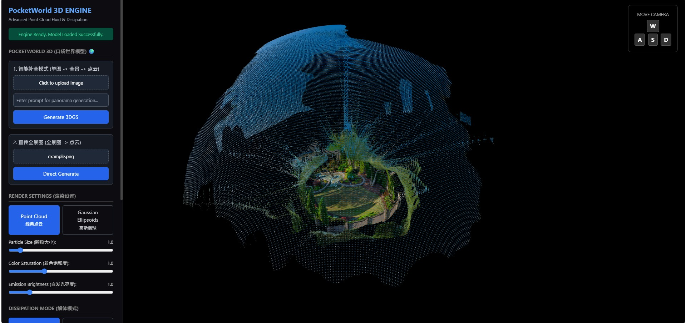
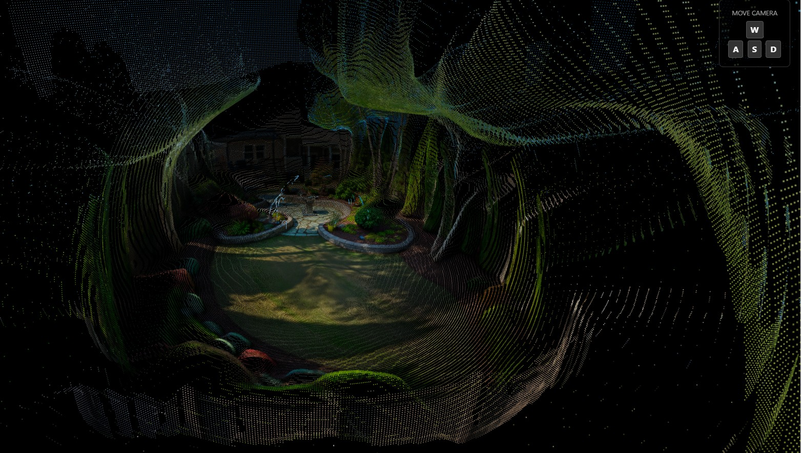
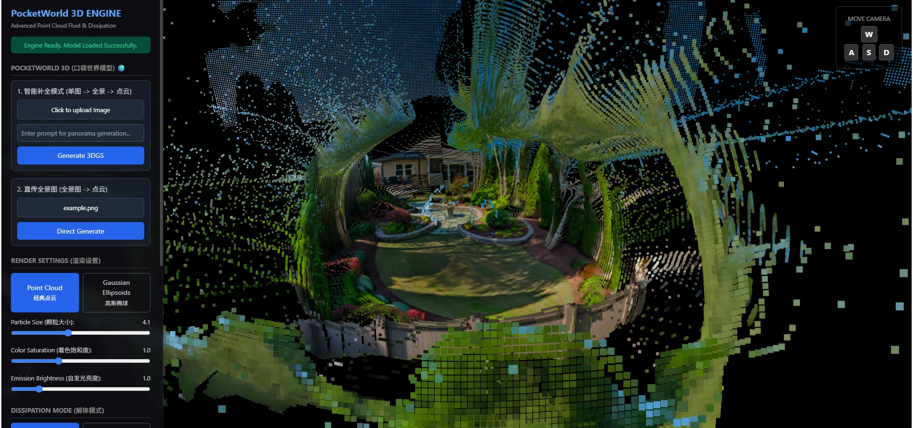
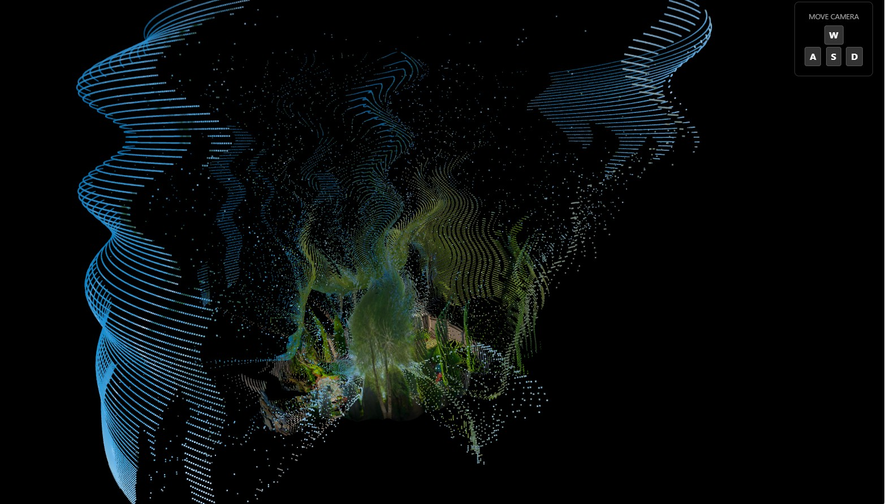

# PocketWorld 3D (口袋世界模型) 🌍






> **💡 极简架构提示**：本项目核心文件仅有两个：`engine.py` (后端引擎) 和 `index.html` (前端交互)。
> **💡 Core Files**: Only two core documents: `engine.py` and `index.html`.

## 📖 项目介绍 (Introduction)

### 🇨🇳 中文介绍
欢迎来到 **PocketWorld 3D (口袋世界模型)**！这是一个主打“完全免费、纯本地运行”的迷你 3D 世界生成玩具。如果你不想为按次收费的商业 3D 生成 API（比如 Marble）掏钱包，又想体验一把“单图生成 3D 空间”的乐趣，那你就来对地方了。

本项目的核心目标很简单：用最直接（且免费）的开源模型组合，将一张普通的 2D 图片转化为可以在浏览器里用 WASD 自由漫游的 3D 点云/高斯椭球场景。**你的显卡就是唯一的物理限制。**

### 🇬🇧 English Introduction
Welcome to **PocketWorld 3D**! This is a 100% free, fully local, "miniature" 3D world generation toy. If you're tired of paying for closed-source 3D generation APIs (like Marble) and just want to have some fun turning a single image into an explorable 3D space, you're in the right place.

The goal of this project is simple: use a straightforward combination of open-source models to transform an ordinary 2D image into a 3D point cloud/Gaussian Splatting scene that you can freely explore in your browser. **Your local GPU is the only limit.**

---

## 🚀 核心特性 (Features)

- 🌌 **单图生成全景**：基于 SDXL Inpainting 强力脑补全景图。
- 🕳️ **深度估算**：集成 DepthAnything 提取精准深度信息。
- 🧊 **3DGS 渲染**：将 2D 图像转化为 3D 高斯椭球点云，支持 Three.js 前端漫游。
- 💸 **完全开源免费**：纯本地推理，无需任何 API Key。

---

## 🛠️ 技术路线 (Technical Pipeline)

1. **全景绘图 (Panorama Outpainting)** 
   - 🇨🇳 接收单张图片，基于 SDXL Inpainting 将其向外延展，强力“脑补”出 360° 全景图。
   - 🇬🇧 Takes a single input image and uses SDXL Inpainting to expand it into a full 360° equirectangular panorama.
2. **深度提取 (Depth Estimation)**
   - 🇨🇳 接入 DepthAnything (Small) 模型，快速提取全景图的深度信息。
   - 🇬🇧 Integrates the DepthAnything (Small) model to extract an accurate depth map from the generated panorama.
3. **3D 重建 (3D Compilation)**
   - 🇨🇳 将 RGB 像素与深度图结合，通过球面坐标系投影到 3D 空间。数据最终被封装成兼容 Three.js 的 3DGS 结构，并导出为标准的 `.ply` 文件（附带 30% 的色彩增强以优化视觉效果）。
   - 🇬🇧 Combines RGB pixels and depth data, projecting them into 3D space via spherical coordinates. The output is packaged into a Three.js-compatible pseudo-3DGS structure and saved as a standard `.ply` file.
4. **前端漫游 (Web Viewer)**
   - 🇨🇳 轻量级的 HTML/JS 前端，直接解析 `.ply` 文件，提供第一人称视角的沉浸式漫游，以及几种好玩的粒子消散特效。
   - 🇬🇧 A lightweight HTML/JS frontend that parses the `.ply` file, offering first-person WASD exploration and several fun particle dissipation effects.

---

## ⚙️ 安装指南 (Installation)

PS：若你是完全的小白，你需要先安装python/pip/Git三样基本工具。以下的所有"```bash"界面进入方法如下：点击windows系统的“开始”后输入"powershell"，再按下回车按键。即可进入小黑框。一行一行地粘贴下方的代码即可。


**1. 克隆项目**
```bash
git clone https://github.com/yourusername/PocketWorld-3D.git
cd PocketWorld-3D
```

**2. 创建并激活虚拟环境 (推荐使用 Conda)**
```bash
# 创建名为 world 的虚拟环境，指定 Python 3.10
conda create -n world python=3.10 -y

# 激活环境
conda activate world
```

**3. 安装核心依赖**
```bash
# 安装 PyTorch (以 CUDA 12.1 为例)
pip install torch torchvision torchaudio --index-url https://download.pytorch.org/whl/cu121

# 锁定关键库版本，防止底层 API 崩溃或语法报错
pip install numpy==1.26.4 diffusers==0.29.2 transformers==4.40.2

# 安装其他运行依赖 (Web API 引擎、图像处理、数据验证等)
pip install accelerate fastapi uvicorn pillow opencv-python pydantic python-multipart plyfile
```

---

## 🎮 运行教程 (How to Run)

本项目分为**后端引擎**和**前端界面**两部分，需要打开两个终端分别运行。

### 第一步：启动后端引擎
打开一个终端（如 Anaconda Prompt），进入你的项目文件夹，激活环境并运行：
```bash
conda activate world
python engine.py
```
> ✅ 成功标志：确保在控制台看到 `Uvicorn running on http://0.0.0.0:8000`。
> ❗ 成功标志：第一次运行可能会下载大量的权重文件（几GB），请确保存储空间足够。中国境内可能需要VPN或者尝试在powershell里输入以下代码来暂时启用国内镜像源。这只是临时生效（仅在当前 PowerShell 窗口有效，关闭后失效）所以不用担心：

```bash
conda activate world
$env:HF_ENDPOINT="https://hf-mirror.com"
python engine.py
```


### 第二步：启动前端服务器
再打开一个新的终端，同样进入你存放 `index.html` 的项目文件夹，运行以下命令：
```bash
python -m http.server 8080
```

### 第三步：在浏览器中访问体验
打开你的 Chrome 或 Edge 浏览器，在地址栏手动输入：
👉 `http://localhost:8080/index.html`

导入图片，点击 **"Generate 3DGS"**，享受你的本地世界模型吧！

---

## 📄 许可证 (License)

本项目采用 **MIT License** 开源。完全免费，欢迎魔改！